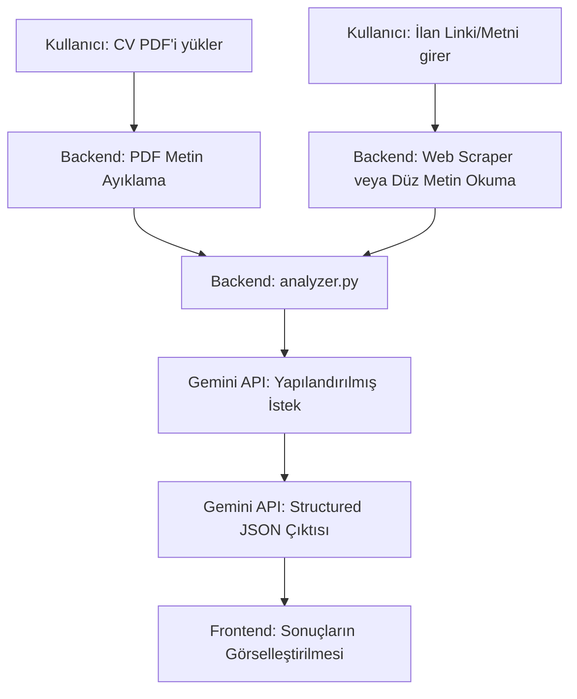

# PRODUCT.md - Ürün ve Yapay Zeka (Gemini) Kılavuzu

Bu belge, **CV ve İş İlanı Uygunluk Analizörü** projesinin iş mantığını, veri modellerini ve Gemini API entegrasyonu için kullanılan prompt şablonlarını tanımlar.

---

## 1. Genel İş Akışı (Business Workflow)

Uygulamanın ana amacı, adayın CV'si ile hedef iş ilanının beklentilerini kıyaslayıp objektif bir eşleşme raporu sunmaktır. Sistem şu aşamalardan geçer:



1.  **Girişlerin Toplanması:** Kullanıcı PDF CV yükler ve iş ilanı URL'sini girer. İsteğe bağlı olarak, bot korumasını aşmak için iş ilanı metnini doğrudan da yapıştırabilir.
2.  **Veri Hazırlama:** 
    *   PDF'ten metin ayıklanır (`pypdf` aracılığıyla).
    *   URL girildiyse arka planda HTML kazınır ve ilan açıklaması ayıklanır. Başarısız olursa hata fırlatılır ve kullanıcı yedek metin alanına yönlendirilir.
3.  **Yapay Zeka Analizi:** Ayıklanan CV metni ile ilan metni Gemini API'ye (`gemini-2.5-flash` modeli) gönderilir. API'den kesin bir JSON formatı dönmesi istenir.
4.  **Sonuç Sunumu:** Dönüş yapan JSON frontend tarafında işlenerek görsel grafikler ve listeler halinde kullanıcıya gösterilir.

---

## 2. API Uç Noktaları (API Endpoints)

### `POST /api/analyze`
Analiz işlemini başlatan ana endpoint.

*   **Request Type:** `multipart/form-data`
*   **Request Body:**
    *   `cv_file`: `File` (Zorunlu, Sadece PDF formatı)
    *   `job_url`: `string` (İsteğe bağlı, kazınacak ilan linki)
    *   `job_text_fallback`: `string` (İsteğe bağlı, ilan metni)
*   **Response (JSON):**
    ```json
    {
      "uygunluk_skoru": 85,
      "ozet": "Adayın veri analizi ve Python deneyimi ilanla oldukça uyumlu...",
      "guclu_yonler": [
        "Python ve Pandas ile veri işleme tecrübesi",
        "İngilizce raporlama yeteneği"
      ],
      "eksik_yonler": [
        "İlanda istenen SQL Server deneyimi CV'de bulunmuyor",
        "Docker ve Kubernetes tecrübesi eksik"
      ],
      "optimizasyon_onerileri": [
        "SQL Server ile yaptığınız geçmiş projeleri CV'nize ekleyin.",
        "Varsa Docker temelli çalışmalarınızı ön plana çıkarın."
      ],
      "mulakat_sorulari": [
        "Geçmiş projelerinizde SQL Server yerine hangi veritabanlarını kullandınız?",
        "Büyük veri kümelerini Pandas kullanarak nasıl optimize edersiniz?"
      ]
    }
    ```

---

## 3. Gemini API Prompt Tasarımı (Structured Analysis Prompt)

Yapay zekanın kararlı bir JSON yanıtı döndürmesi için sistem promptu ve Pydantic şeması kullanılır.

### Sistem Promptu Şablonu:
```text
Sen profesyonel bir İnsan Kaynakları (İK) Uzmanı ve Teknik İşe Alım Yöneticisisin.
Sana bir adayın CV metni ile başvurmak istediği iş ilanı metni verilecek.
Görevin, adayın bu ilan için uygunluğunu derinlemesine analiz etmektir.

Analiz sırasında şunlara dikkat et:
1. Uygunluk Skoru: Adayın ilan gereksinimlerini (teknik beceriler, tecrübe yılı, eğitim, dil vb.) ne oranda karşıladığını 0 ile 100 arasında bir puan olarak belirle.
2. Güçlü Yönler: Adayın ilanla doğrudan örtüşen yetkinliklerini, projelerini ve deneyimlerini listele.
3. Eksik Yönler: İlanda kritik olarak istenen ancak adayın CV'sinde açıkça belirtilmeyen veya eksik olan yönleri listele.
4. CV Optimizasyon Önerileri: Adayın bu işe kabul alma şansını artırmak için CV'sinde nasıl güncellemeler yapması gerektiğine dair somut ve eyleme dökülebilir tavsiyeler ver.
5. Mülakat Soruları: İlan gereksinimleri ve adayın CV'sindeki boşluklar göz önünde bulundurularak, teknik mülakatta adaya sorulabilecek 3-4 adet nokta atışı soru hazırla.

Tüm çıktıları Türkçe olarak ve belirlenen JSON şemasına birebir uyacak şekilde üret.
```

### JSON Çıktı Şeması (Pydantic):
```python
from pydantic import BaseModel, Field
from typing import List

class CVAnalysisResult(BaseModel):
    uygunluk_skoru: int = Field(description="0-100 arası uygunluk skoru")
    ozet: str = Field(description="Adayın ilanla genel uyumunu özetleyen 2-3 cümlelik paragraf")
    guclu_yonler: List[str] = Field(description="Adayın ilan gereksinimlerini karşılayan güçlü yönleri")
    eksik_yonler: List[str] = Field(description="Adayın CV'sinde eksik olan gereksinimler ve zayıf yönler")
    optimizasyon_onerileri: List[str] = Field(description="CV'yi bu ilan için daha çekici kılacak somut tavsiyeler")
    mulakat_sorulari: List[str] = Field(description="Bu CV ve ilan özelinde hazırlanmış mülakat soruları")
```
